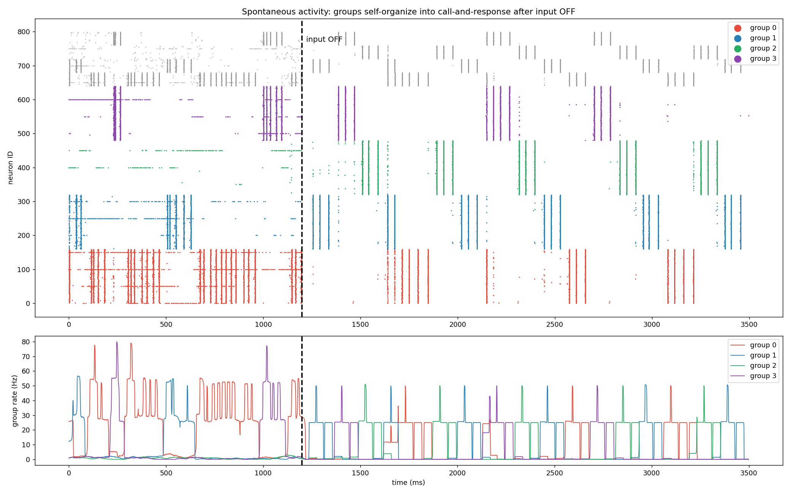
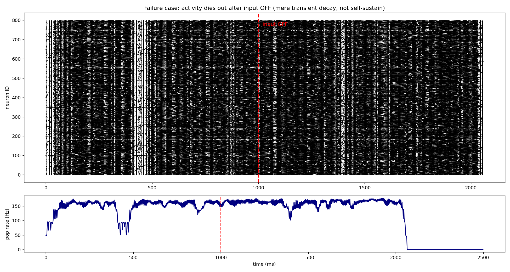
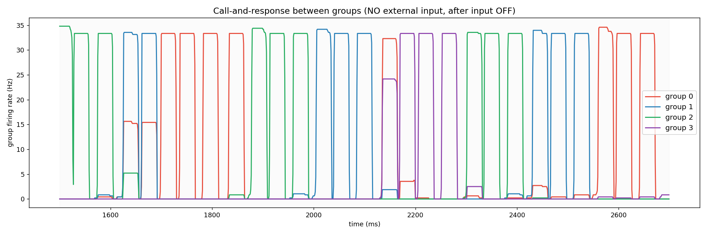

# spontaneous-snn

外部入力を遮断した後もスパイキングニューラルネットワーク（SNN）が自発的に活動を維持し、ニューロン群同士が掛け合い（call-and-response）を始める現象を、`numpy` だけで再現する実験コード。

素朴なノイズ注入では活動が沈黙してしまうところから出発し、生物学的に妥当な3要素（**内因性電流・クラスタ構造・スパイク適応**）を加えることで、入力ゼロでの永続的な自発活動と群の交代リズムが創発するまでを扱う。


---

## デモ

`python spontaneous_snn.py` を実行すると、以下のラスタプロット（`spontaneous_result.png`）が生成される。



黒破線が「入力OFF」の瞬間で、その右側は外部入力が一切ない領域。それでも4つの群（赤・青・緑・紫）が色分けされて活動を続け、群ごとに縞状に分離している。下段の群活動を見ると、群同士が山を譲り合っているのがわかる。

---

## 背景：何をやろうとしたか

人間は、外からの命令（タスク）がないときに、勝手に貧乏ゆすりをしたり、鼻歌を歌ったり、意味もなく指をトントン鳴らしたりする。この「暇なときに湧いてくる、意味のない自発的なふるまい」がどこから来るのか、というのが出発点。

立てた仮説はこうだ。

> 外部からの命令がなくなって脳が「暇」になると、脳内に電気信号のノイズ（≒退屈・むずむず）が溜まる。脳はそれを処理するために勝手に意味のない行動を生成しており、生き物の自発性とは、脳のノイズを処理する過程から湧き出す副産物なのではないか。

この仮説をSNNで再現しようとした。ただし、**「複雑さ」を報酬にはしない。** 「複雑なリズムを出せたら勝ち」と採点すれば複雑さが出るのは当然で、それは仮説の検証にならない。あくまで生存条件（恒常性）だけを課し、そこから副産物として構造が出るかを見る、という方針を取った。

---

## 失敗の記録

このリポジトリの本質は「うまくいった最終形」だけでなく、**そこに至るまでの失敗**にある。詳細は解説記事に譲るが、要点だけ記す。

| # | 試したこと | 結果 |
| --- | --- | --- |
| 1 | ノイズ注入＋恒常性のみを報酬にGA | 入力OFFで即沈黙。「受動的な脳」に進化しただけ |
| 2 | 「入力OFFでも活動維持」を報酬に追加 | 余韻を自走と誤判定していただけ。長く切ると沈黙 |
| 3 | スペクトル半径を臨界（≈1.0）に調整 | スパイキングモデルには効かず、全滅 |
| — | **原因の言語化** | 素朴なモデルは「飽和か沈黙の二択」で、中間は過渡的減衰に過ぎない |

下図は失敗パターンの典型。入力OFF後、一見持続するように見えるが過渡的減衰に過ぎず、やがて完全に消える。



この壁を越えたのは、賢い報酬設計ではなく、**生物が実際に持っている仕組みをモデルに素直に足すこと**だった。

---

## 仕組み：創発を生んだ3つの要素

### ① 内因性電流（永続自走）

生物のニューロンは外部入力がなくても自発発火しようとする内因性電流を持つ。各興奮性ニューロンに個体差つきの小さな定常入力を常時与える。

```python
bias[:N_EXC] = I_BIAS * (0.5 + rng.random(N_EXC))
I = (W.T @ prev) * GAIN + bias   # シナプス入力に常時上乗せ
```

これで `I_BIAS >= 0.04` のとき、入力OFF後も 25〜50Hz で活動が持続するようになった。

### ② クラスタ構造（群の分化）

興奮性ニューロンを4群に分け、群内を密結合にする。ただしこれだけだと全群が同期してしまう（群間相関 +0.9）。

### ③ 側方抑制＋スパイク適応（掛け合い）

- **側方抑制**：各群の抑制ニューロンが「他の群」を抑える（勝者総取り構造）。
- **スパイク適応**：発火し続けたニューロンは疲労して発火しにくくなり、時定数で回復する。「鳴り続けた群が疲れて他群に譲る」動きを生む。

```python
thr = thr0 + adapt
adapt = adapt * (1 - DT/ADAPT_TAU) + fired * ADAPT_STR
```

結果、群同士が交互に発火する掛け合いが創発した（群間相関 −0.25）。



このタイミングや順序は**どこにも指定していない。** 物理的な条件だけを置いた結果、勝手に湧いて出た。

---

## 実行方法

```bash
pip install -r requirements.txt
python spontaneous_snn.py
```

依存は `numpy` と `matplotlib` のみ。M1 Pro / 16GB のローカルで数分で完走する。

---

## パラメータ

`spontaneous_snn.py` 冒頭の定数で挙動を調整できる。

| 定数 | 意味 | 目安 |
| --- | --- | --- |
| `I_BIAS` | 内因性電流の強さ | 小さすぎると沈黙、大きすぎると飽和。0.04〜0.06 が自走レンジ |
| `W_INH` | 側方抑制の強さ | 群同士を抑え合わせて交代を生む |
| `ADAPT_STR` | スパイク適応の強さ | 疲労の蓄積量。掛け合いの深さを決める |
| `ADAPT_TAU` | 適応の回復時定数(ms) | 掛け合いのリズムの速さを決める |
| `N_CLUSTER` | 群の数 | 増やすとより複雑な掛け合いに（要調整） |

---

## 今後の方向

この掛け合いの「語彙」がどこまで豊かになるかを試したい。群の数を増やす、適応の時定数を変える、群間の抑制構造を非対称にするなどして、より複雑な「宇宙人言語」を出せるかを検証する予定。

---

## 注意

これは自発性の「起源を証明」するものではなく、特定のSNNモデル上で自発的パターンが創発する条件を一つ見つけた個人的な検証記録である。自己組織化臨界やリザバー計算といった既存研究と重なる部分が多いはずで、学術的新規性を主張するものではない。

## ライセンス

MIT
